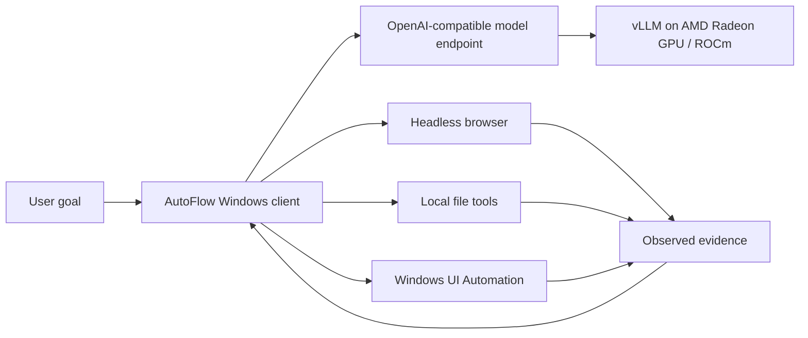

# AutoFlow 0.8 — AMD Radeon Private AI Desktop Agent

AutoFlow is a Windows desktop automation agent that turns a natural-language goal into an observe–plan–act–verify loop. It combines private model inference on AMD Radeon GPUs with headless web automation, local file tools, and Windows UI Automation.

This repository is prepared for **Track 2: Development & Local Deployment of Private AI Agents** of the AMD AI DevMaster Hackathon.

## Why AutoFlow

- Users describe the final result instead of recording fixed mouse coordinates.
- Web tasks run in a headless browser without taking over the mouse.
- File tasks use local Python or restricted PowerShell tools.
- Desktop applications use semantic Windows UI Automation controls before falling back to foreground input.
- High-risk side effects must be explicitly present in the original user goal.
- Model credentials stay in Windows Credential Manager and are not written to source files or logs.

## AMD Radeon / ROCm architecture

AutoFlow separates the Windows interaction client from private model inference:



The Model Center includes a dedicated **AMD Radeon Cloud / ROCm** provider. It supports:

1. AMD Radeon Cloud shared OpenAI-compatible model APIs.
2. A private vLLM endpoint deployed on a Radeon Cloud instance.
3. An OpenAI-compatible vLLM endpoint hosted on a supported local or LAN AMD ROCm machine.

The Windows client does not require the GPU host to expose desktop access; only the authenticated model API is needed.

## Install and run

Requirements:

- Windows 10 or Windows 11
- Python 3.10 or newer
- Microsoft Edge or Google Chrome
- Network access to the selected model endpoint

```powershell
git clone <your-fork-url>
cd autoflow-code
py -3 -m venv .venv
.\.venv\Scripts\python.exe -m pip install -e ".[dev]"
.\.venv\Scripts\autoflow-gui.exe
```

Open `http://127.0.0.1:8765/`. The server binds only to `127.0.0.1`.

Windows users may also double-click `启动AutoFlow.bat`.

## Connect an AMD Radeon model

1. Open **Model Center**.
2. Select **AMD Radeon Cloud / ROCm**.
3. Enter the HTTPS Base URL, model ID, and API key supplied by the shared or dedicated Radeon endpoint.
4. Click **Connect and verify**.
5. Return to **Task Center** and keep **Smart silent mode** enabled.

See [AMD_ROCM_DEPLOYMENT.md](submission/AMD_ROCM_DEPLOYMENT.md) for the reproducible deployment and evidence workflow.

## AMD environment and benchmark evidence

Run this command on the AMD GPU host:

```bash
python scripts/collect_amd_evidence.py --output submission/evidence/amd-environment.json
```

After selecting the AMD provider in AutoFlow, run this on the Windows client:

```powershell
.\.venv\Scripts\python.exe scripts\benchmark_amd_endpoint.py `
  --runs 5 `
  --output submission\evidence\amd-endpoint-benchmark.json
```

Neither evidence file contains an API key. Hardware verification must be performed on Radeon Cloud or a supported AMD host; it is intentionally not fabricated on non-AMD development machines.

## Tests

```powershell
.\.venv\Scripts\python.exe -m pytest -q
.\.venv\Scripts\python.exe examples\demo_mvp.py
.\.venv\Scripts\autoflow.exe amd-check
```

## Repository map

- `autoflow/` — agent runtime, model providers, browser and desktop tools
- `autoflow/headless_browser.py` — silent Playwright execution
- `autoflow/amd.py` — AMD Radeon and ROCm diagnostics
- `scripts/` — evidence collection and endpoint benchmark
- `tests/` — automated regression tests
- `submission/` — English Track 2 specification, deployment guide, demo script and PR materials

## Current verification status

- Windows installation, Demo and automated test suite: verified.
- Headless browser end-to-end model routing: verified.
- AMD provider, diagnostics and evidence pipeline: implemented and regression-tested.
- Final AMD Radeon hardware evidence and video: must be captured on Radeon Cloud or a supported AMD GPU before the competition PR is submitted.

## Security boundaries

- Webpage content is untrusted data and cannot override the original user goal.
- Remote endpoints carrying an API key must use HTTPS.
- Built-in provider endpoints cannot be silently redirected, except the explicitly editable AMD/private provider.
- Destructive, payment, upload and submission actions require matching intent in the original goal.
- The local HTTP API requires exact same-origin JSON requests.

## Submission documents

- [Project specification](submission/PROJECT_SPECIFICATION.md)
- [AMD Radeon / ROCm deployment](submission/AMD_ROCM_DEPLOYMENT.md)
- [Architecture](submission/ARCHITECTURE.md)
- [Demo recording script](submission/DEMO_SCRIPT.md)
- [Submission checklist](submission/SUBMISSION_CHECKLIST.md)
- [Exact final submission steps](submission/FINAL_STEPS.md)
- [Prepared PR body](submission/PR_BODY.md)
- [AMD Track 2 presentation](submission/AutoFlow-AMD-Track2.pptx)

Run `python scripts/check_submission_readiness.py` before opening the final Pull Request. The command fails closed until real AMD evidence and participant-provided submission information are present.

## License

Copyright remains with the project owner. Add the intended open-source license before publishing the final competition fork.
