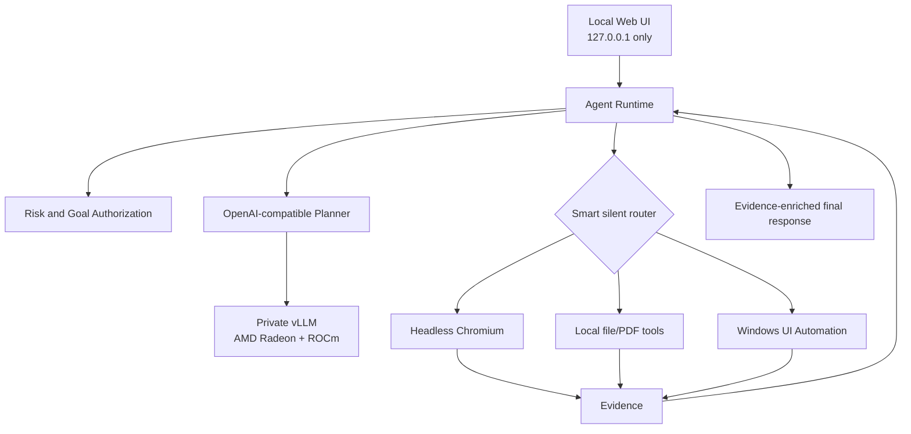

# AutoFlow Architecture

## Trust boundaries

| Boundary | Protection |
|---|---|
| Browser page → Agent | Page text is untrusted and cannot override the goal |
| Web UI → local API | Exact Origin/Host and JSON content type |
| Agent → model endpoint | HTTPS for remote credentials; explicit AMD endpoint field |
| Model → computer tools | Registered tools only; risk classification before execution |
| PowerShell → filesystem | Literal goal-scoped paths; compound/opaque commands blocked |
| Credentials → storage | Windows Credential Manager; excluded from project and logs |
